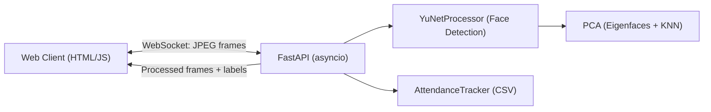

## 🎯 Real‑Time Face Recognition & Attendance (YuNet + PCA)

Dự án trình diễn pipeline nhận diện khuôn mặt thời gian thực trên trình duyệt:
- Dò khuôn mặt bằng YuNet (OpenCV, cực nhanh, chạy tốt trên CPU)
- Nhận diện “đó là ai” bằng PCA (Eigenfaces) + KNN với ngưỡng khoảng cách
- Streaming webcam qua FastAPI WebSocket, kết quả trả về theo thời gian thực
- Tự động ghi danh (attendance) vào CSV, hiển thị trực tiếp trên web UI

Đã từng dùng YOLOv8 để test demo (object detection), nhưng bản hiện tại tập trung vào YuNet (face detection) + PCA (face recognition).

### 🎥 Demo

- Xem nhanh qua các GIF bên dưới (click để xem kích thước đầy đủ):

  
  
  

> Tham khảo thêm báo cáo chi tiết tại file PPS_Nhom_2_report.pdf để hiểu rõ thuật toán và các quyết định thiết kế.

## 🌟 Key Features

- Real‑time Face Detection: YuNet (OpenCV) tốc độ cao, thân thiện CPU
- Face Recognition: PCA (Eigenfaces) + KNN với threshold để xử lý “unknown”
- FastAPI + WebSocket: Truyền hình ảnh 2 chiều, latency thấp ngay trong trình duyệt
- Automatic Attendance: Ghi lại mỗi người duy nhất một lần với timestamp (CSV)
- Multi‑Client: Hỗ trợ đồng thời đến 4 phiên kết nối
- Batch & Queue: Gom khung hình, kiểm soát backpressure để mượt và ổn định
- Deploy linh hoạt: Chạy local, tùy chọn ngrok để public nhanh
- Optimized YOLOv8 (demo): FP16 + CUDA + batch; chạy mượt trên RTX 4050

## 🧠 Why YuNet + PCA (thay vì YOLO cho nhận diện)?

- YuNet: chuyên dò khuôn mặt rất nhanh, phù hợp CPU, không cần GPU
- PCA (Eigenfaces): giảm chiều dữ liệu ảnh, trích xuất đặc trưng khuôn mặt “gọn mà chất”
- KNN + threshold: đơn giản, dễ kiểm soát ngưỡng unknown; huấn luyện cực nhanh
- YOLOv8 vẫn có trong repo như phần thử nghiệm object detection, nhưng pipeline chính cho face recognition là YuNet → PCA

## 🏗️ Kiến trúc tổng quan

## 🛠️ Kỹ năng/Tech áp dụng

- Machine Learning: PCA (Eigenfaces), KNN, xử lý ảnh với OpenCV
- Backend Realtime: FastAPI + WebSocket, asyncio, queue/batching, multi‑client
- Triển khai mô hình: đóng gói/serialize model (pickle), quản lý kích thước ảnh, tiền xử lý
- Thiết kế mã: tách lớp rõ ràng (processor, tracker), OOP và khả năng thay thế mô‑đun (YOLOv8 ↔ YuNet)
- Ghi log dữ liệu: CSV attendance, API nhỏ để đọc log hiển thị UI
- Frontend: không chuyên sâu frontend, UI nhẹ, responsive để demo và thao tác nhanh

## 🚀 Chạy dự án (Local)

Yêu cầu: Python 3.10+ (khuyến nghị), Windows/Linux/macOS

1) Tạo và kích hoạt virtual env
- Windows
  - python -m venv venv
  - venv\Scripts\activate
- Linux/macOS
  - python -m venv venv
  - source venv/bin/activate

2) Cài dependencies
- pip install -r requirements.txt

3) Kiểm tra models có sẵn
- models/face_detection_yunet_2023mar.onnx
- models/pca_model.pkl (đã được train sẵn; có thể tự train lại – xem bên dưới)

4) Chạy server
- python src/video_streaming.py

5) Mở giao diện web
- http://127.0.0.1:8080/static/index.html

Tip: Nếu muốn public nhanh, bạn có thể cấu hình ngrok rồi expose cổng 8080.

## 📦 Cấu trúc chính

- src/video_streaming.py: FastAPI server, WebSocket endpoints, pipeline YuNet → PCA
- src/backend/pca_yunet_processor.py: YuNetProcessor + PCA implementation
- src/backend/attendance_tracker.py: log người đã ghi danh vào CSV
- public/index.html, scripts.js, styles.css: UI web, gửi/nhận frame realtime
- models/: onnx YuNet + PCA .pkl
- logs/attendance_log.csv: file CSV điểm danh

## 🔁 Huấn luyện/ cập nhật PCA model của riêng bạn

Có 2 luồng điển hình:

- Pipeline huấn luyện PCA offline (ảnh tĩnh):
  - Chuẩn bị dataset khuôn mặt (xám, resize về 92×112 sẽ tối ưu cho model mặc định)
  - Chạy script huấn luyện (ví dụ trong repo: src/face_recognization.py) để tạo models/pca_model.pkl
  - Khi chạy server, model PCA sẽ được load từ models/pca_model.pkl

- Tạo dataset từ video (tuỳ chọn):
  - src/upload_dataset.py có sẵn helper để trích ảnh từ video làm dataset

Lưu ý: PCA hiện dùng KNN và threshold để quyết định “unknown”. Bạn có thể tinh chỉnh số thành phần PCA, k láng giềng, hoặc ngưỡng khoảng cách để cân bằng giữa chính xác và khả năng từ chối người lạ.

## 🔧 Tuỳ biến/Chuyển đổi mô‑đun

- Mặc định: YuNet để detect khuôn mặt, PCA để nhận diện
- YOLOv8 (src/backend/yolo_processor.py) vẫn còn trong repo để tham khảo/test object detection; không bật mặc định trong server
- Bạn có thể thay thế/hoặc thêm logic nhận diện khác (SVM, cosine similarity…) dễ dàng nhờ cấu trúc tách lớp

## 📑 API nhỏ kèm theo

- GET /health: trạng thái server, số client đang kết nối
- GET /api/attendance: đọc danh sách người đã điểm danh (để UI render)
- GET /api/config: trả URL backend/WS (hỗ trợ khi dùng ngrok)

## ⚙️ Hiệu năng và độ ổn định

- YuNet chạy mượt trên CPU; WebSocket gửi JPEG frame với tần số mục tiêu (mặc định 15 FPS) để cân bằng chất lượng/băng thông
- YOLOv8 (demo) tối ưu FP16 + CUDA, chạy rất mượt trên RTX 4050 (FPS cao, latency thấp)
- Batching + queue hạn chế backlog, tránh giật/đơ khi nhiều client
- Xử lý ngoại lệ an toàn để phiên client không làm sập server

